-------------------------------------------------------------------------------
CIS565 Project 4: CUDA Rasterizer
-------------------------------------------------------------------------------
Jiawei Wang

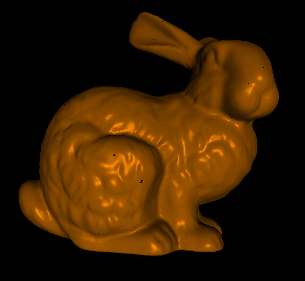

Video Links
--------------
http://youtu.be/4DRzrCgamzY

Project Overview
---------------
  This project is a simple version of CUDA software rasterizer without using any OpenGL functions. The CUDA based graphic rasterization pipeline is similar to the OpenGL pipeline, which includes: vertex shading, primitive assembly, perspective transformation, rasterization, fragment shading, and write the resulting fragments to a framebuffer then rendering image out. 

Basic Features
---------------
  I have implemented all the basic pipeline steps as following:
  - Vertex Shading
  - Primitive Assembly with support for triangle VBOs/IBOs
  - Perspective Transformation
  - Rasterization through either a scanline or a tiled approach
  - Fragment Shading
  - A depth buffer for storing and depth testing fragments
  - Fragment to framebuffer writing
  - A simple lighting/shading scheme, such as Lambert or Blinn-Phong, implemented in the fragment shader

Additional Features
---------------------
Also implemented additional features as following:
  - Correct color interpolation between points on a primitive
  - WireFrame mode and Vertices mode
  - Mouse and keyboard view control
  
The Youtube video is a demo of these features.

Details about features
------------------------
Without fragmentShade implementation, without lights:
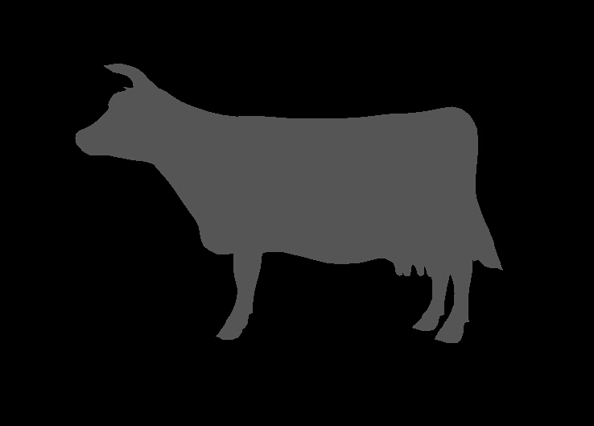

If show the color with BaryCenter Interpolation:
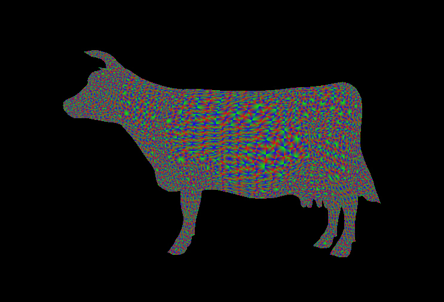

After implementing fragmentShade, add diffuse and specular effect to models:
 1). Without Bary Center Interpolation bunny:
  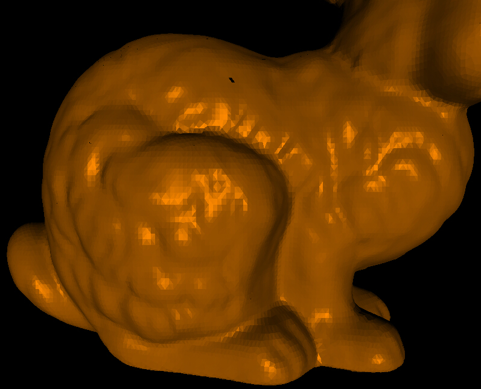
 2). With Bary Center Interpolation bunny:
  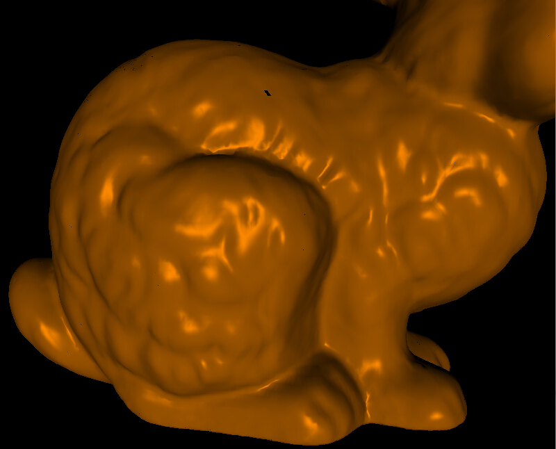
  
Also, there is an interesting colorful bunny when I debug the missing triangles for the scanline rasterization part, the colorful bunny looks pretty:
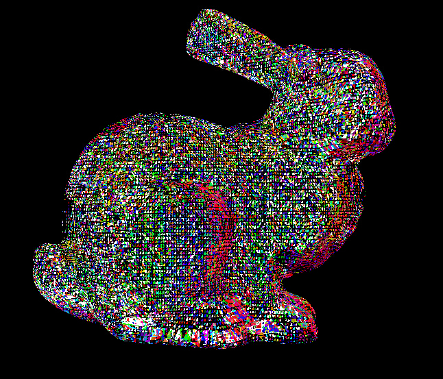

By rasterizing only the triangle frames or triangle vertices, we can get another two view for models, wireframe and vertices:
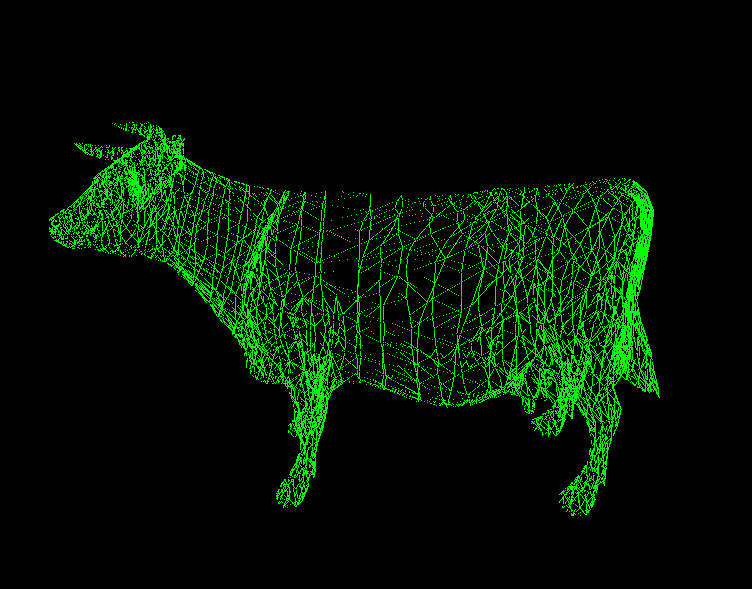
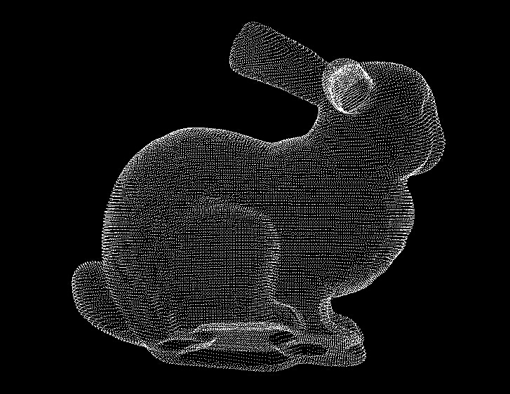

Not only the primitive normals can be used in the fragmentShade part, but also can be used as debug tool, just assign color to the normal:
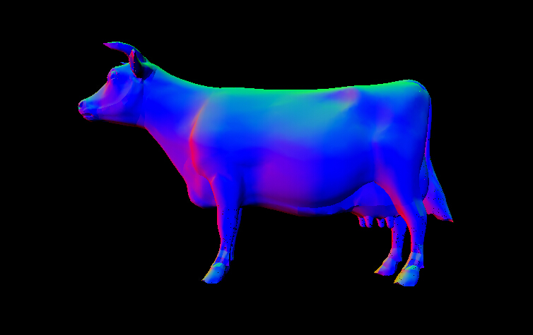
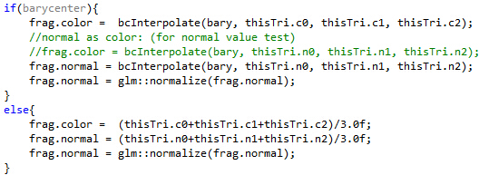

A complicated and interesting objects:
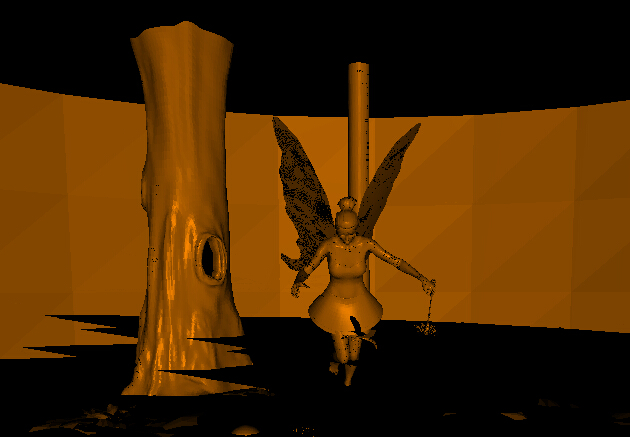

