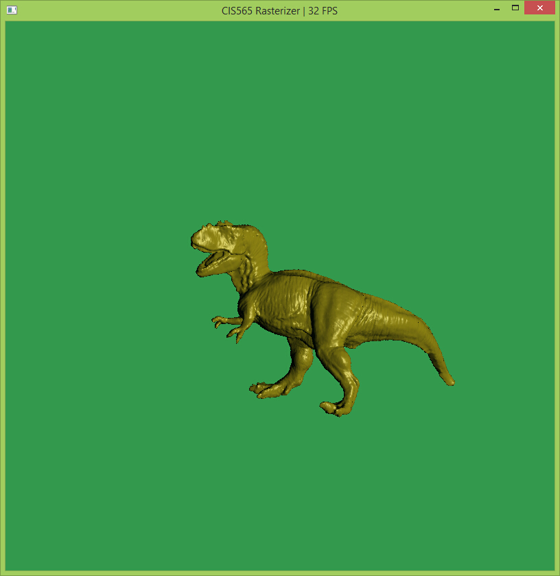
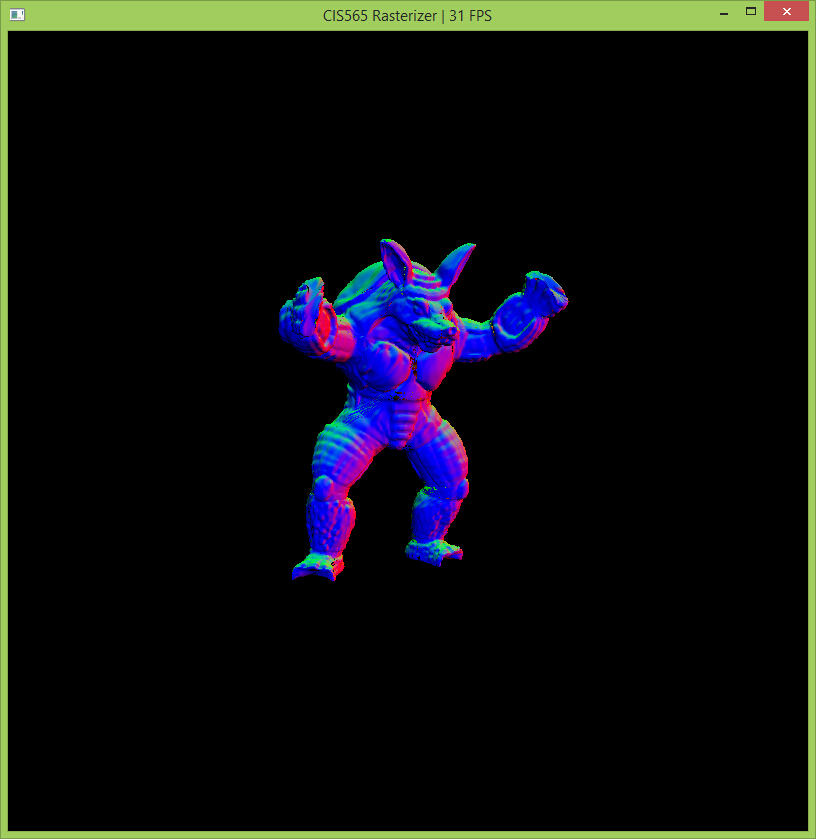
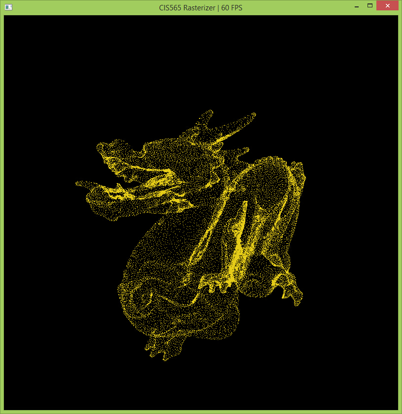

-------------------------------------------------------------------------------
Software Rasterizer implemented using CUDA
-------------------------------------------------------------------------------

-------------------------------------------------------------------------------
This is a CUDA based software implementation of a standard rasterized graphics pipeline, very similar to the OpenGL pipeline.
The following is a quick overview of the structure and features of my rasterizor. Implementation details will be explained later.
###Pipe-line stages:

* Vertex Shading
* Primitive Assembly
* Back-Face Culling
* Scanline rasterization
* Fragment Shading
* Render

###Other features:

* Mouse-based interactive camera
* Mesh View
* Vertices View
* Color interpolation

###Reulsts

[Video Demo] (https://www.youtube.com/watch?v=_TUVPTLyZR0&list=UU8ix41TAtWn-RDD6gC8ml3A)

Tyra (200,000 faces)

Cow (5,804 faces) - flat shading
![] (cowFlat.jpg)

Cow (5,804 faces) - phong shading
![] (cowPhong.jpg)

Donut - phong
![] (donutPhong.jpg)

Donut - mesh
![] (donutMesh.jpg)

Armadillo (212,000 faces) - camera space normal

Dragon (100,000 faces) - vertices

###Implementation Details
* Vertex Shading

Takes in vertex buffer, normal buffer and modelView matrix and transform vertices and normals to camera space. CUDA Kernel parallel on vertex i.e. each thread deals with one vertex.

* Primitive Assembly

Takes in vertex buffer, normal buffer and index buffer, then assembles them into primitives as an array of triangles, the normal for the triangle is calculated here and stored in the triangle.
CUDA Kernel parallel on every three vertices i.e. each thread deals with 3 vertices (1 triangle).

* Back-Face Culling

Given the array of primitives, it removes triangles that faces away from the camera according to its normal. The removal uses Thrust::remove_if for maximum efficiency.

#####Performance impact of back-face culling

Model| No Back-face culling| with Back-face culling
----- | ----- | -----
bunny (5,800 faces)| 19 FPS | 26 FPS
dragon (100,000 faces) |16 FPS | 22 FPS
Tyra (200,000 faces) | 18 FPS | 24 FPS

From the table, we can see, the performance gain of back-face culling is about 40%, independent of number of faces. This makes sense, about 50% of faces are back faces, and the 10% is probably a result of stream compacting
the primitive array.

* Scanline rasterization

CUDA Kernel parallel on primitive i.e. each thread deals with one triangle. Several tasks are done in this stage. First of all, it transforms all all vertices and normals of the triangle into NDC space.
Then, it calculates a bounding box of the triangle, and it loops through all fragments within this box. For each fragment, it calculates its barycentric coordiates in the triangle. Fragment will be discarded if
it's Not in the triangle (according to its barycentric coordinates). If it's in the triangle, using the barycentric coordinates, a correctly interpolated color and normals will be calculated.
Finally, it checks the pixel this fragment occupies in the depthbuffer and tests whether this fragment is in front of the one in the buffer, if yes, then we swap in this fragment. While this is happening this position
in the depth buffer is locked. The lock is created using a bufferIsLockFlag array and CUDA atomic exchange function. This ensures there's no conflict of multiple threads trying to read and write to the same location in the
depthbuffer.

* Fragment Shading

It calculates the local illumination (diffuse + specular + ambient) of the given fragment. Up to user's choice, it can either treats each triangle as flat or as smooth by using interpolated normal for each fragment.
CUDA Kernel parallel on each fragmenti.e. each thread deals with one fragment in the depthbuffer.

* Render

transfers data from depthbuffer to framebuffer. No other fancy stuff happens here, however, this stage will be very useful if there's translucent surface in the scene.

###Other features:

* Mouse-based interactive camera

Click and drag to rotate, scroll to zoom in and out. 

W,A,S,D to move camera position.

F to toggle flat/phong shading.

M to toggle shaded/mesh view.

It's implemented using GLFW glfwGetMouseButton,glfwGetCursorPos for getting necessary inputs for setting up the camera according to mouse movement.

* Mesh View

This is done at the rasterization stage, where according to the barycentric coordinates of the fragment, it decides whether it's on an edge. Fragments that are not on any edge will be flagged as discarded.

* Vertices View

This is done in rasterization stage, where it only produces fragments that are the vertices of the given triangle.

* Color interpolation

In the rasterization stage, the color of the fragment is interpolated among the 3 vertex colors of the triangle using barycentric coordinates.

###Performance Analysis
Graphics Card: NVIDIA GeForce GTX 660

model: stanford bunny ( 5,804 faces )

![] (chart1.jpg)

From the graph, it's clear that when objects are further from the camera the higher FPS. This is because each triangle takes up less pixels, thus the loop through all pixels for each primitives will be much faster.

From other tests, I also found that the number of faces does not matter very much to the FPS, however the size of each triangle matters the most since the rasterization parallels on each triangle.
Thus the rasterizor is most efficient when there's a large number of triangles and each covers small area on the screen and overall the sizes of triangles has as little variance as possible.

