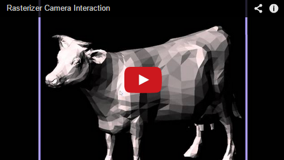

-------------------------------------------------------------------------------
CIS565: Project 4: CUDA Rasterizer
-------------------------------------------------------------------------------

-------------------------------------------------------------------------------
INTRODUCTION:
-------------------------------------------------------------------------------
This is a simplified CUDA based implementation of a standard rasterized graphics pipeline, similar to the OpenGL pipeline.   
The pipeline includes vertex shading, primitive assembly, perspective transformation, rasterization, fragment shading, and write the resulting fragments to a framebuffer.

-------------------------------------------------------------------------------
BASIC FETAURES:
-------------------------------------------------------------------------------

* Vertex Shading
* Primitive Assembly with support for triangle VBOs/IBOs
* Perspective Transformation
* Rasterization through either a scanline or a tiled approach
* Fragment Shading
* A depth buffer for storing and depth testing fragments
* Fragment to framebuffer writing
* A simple lighting/shading scheme, such as Lambert or Blinn-Phong, implemented in the fragment shader

-------------------------------------------------------------------------------
ADVENCED FEATURES:
-------------------------------------------------------------------------------
* MOUSE BASED interactive camera support  
- mouse left click + drag: rotate the camera around the lookat center  
- mouse right click + drag: translate the camera lookat point  
- mouse scroll: zoom in/out  
The video below shows how the interaction is like.  

[] (http://youtu.be/34XS6eS-lT8)    
* Back-face culling  
* Lines
* Points
* Order-independent translucency using a k-buffer
* Correct color interpolation between points on a primitive
* Texture mapping WITH texture filtering and perspective correct texture coordinates
* Blending

-------------------------------------------------------------------------------
PERFORMANCE EVALUATION
-------------------------------------------------------------------------------
The performance evaluation is where you will investigate how to make your CUDA
programs more efficient using the skills you've learned in class. You must have
performed at least one experiment on your code to investigate the positive or
negative effects on performance. 

We encourage you to get creative with your tweaks. Consider places in your code
that could be considered bottlenecks and try to improve them. 

Each student should provide no more than a one page summary of their
optimizations along with tables and or graphs to visually explain any
performance differences.

