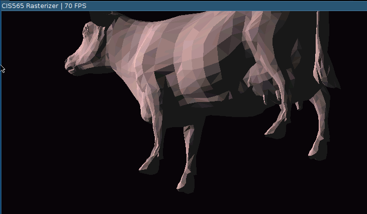
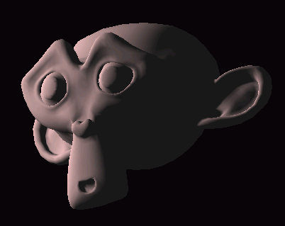
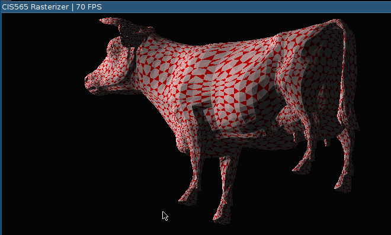
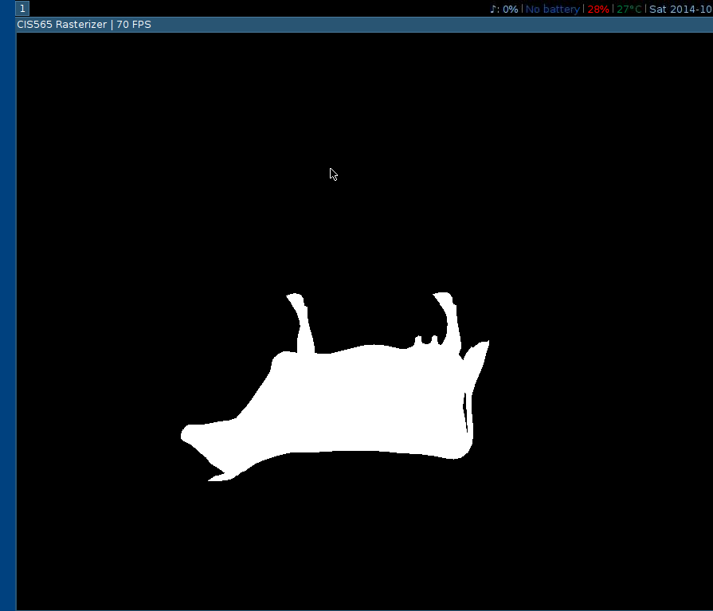
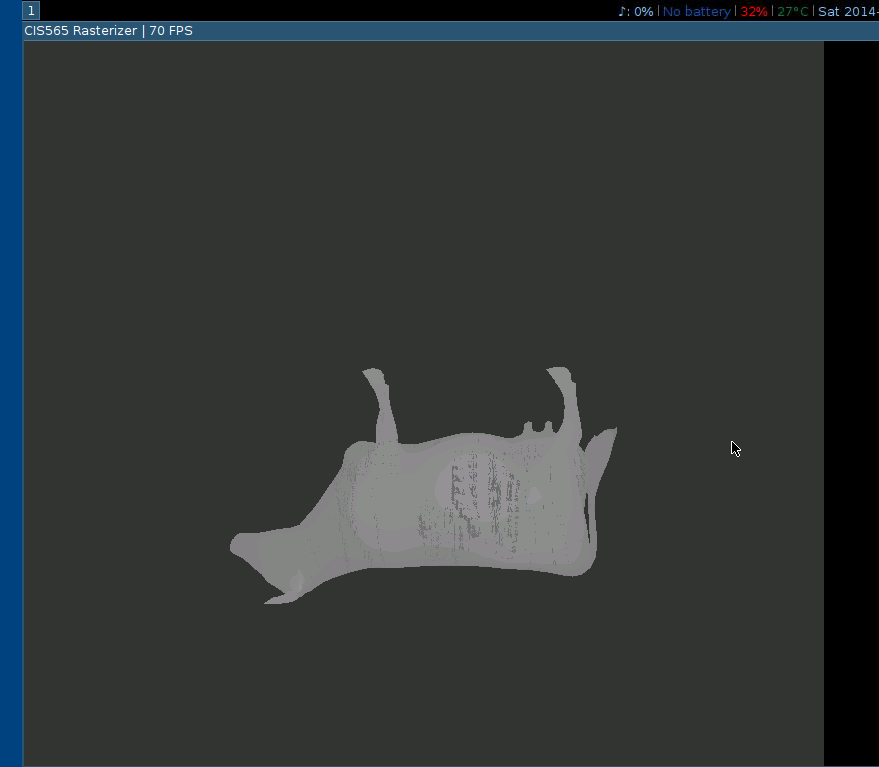
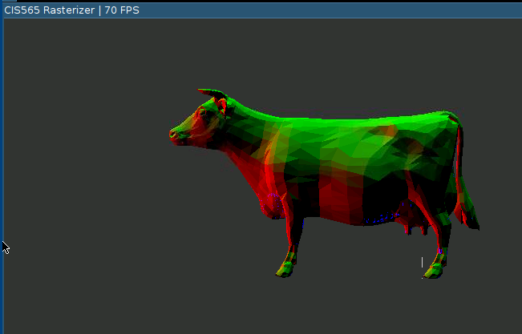
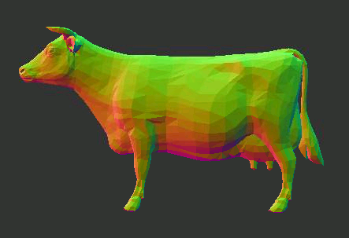
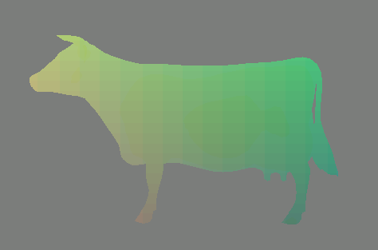

CIS 565 Project 4: CUDA Rasterizer
==================================

* Kai Ninomiya (Arch Linux/Windows 8, Intel i5-4670, GTX 750)

Base Code Features
------------------

* A library for loading/reading standard Alias/Wavefront .obj format mesh files
  and converting them to OpenGL style VBOs/IBOs
* A suggested order of kernels with which to implement the graphics pipeline
* Working code for CUDA-GL interop

Features Implemented
--------------------

* Vertex shader
  * Model-view-projection transformation
* Primitive Assembly with support for triangle VBOs/IBOs
* **Geometry shader**
  * Maps 1 triangle to 0-4 triangles.
  * **Backface culling** (somewhat more efficient than culling in the
    rasterization step).
* Basic scanline rasterization into a fragment buffer
  * Depth-testing
  * Barycentric **interpolation of vertex data**
    * Color: not visible on uncolored model
    * Normals: visible with suzanne.obj model
    * World-space position: used in lighting calculations
  * Using `atomicMin` to **avoid race conditions in depth testing**
* Fragment shading
  * Lambert diffuse per-fragment lighting
* Fragment to framebuffer writing

(Extras in **bold**.)

Renderings
----------

Diffuse shading:

Diffuse shading showing normal interpolation:

Tessellation in geometry shader:

Feature Performance
-------------------

| Feature           | Frame time | Added time | Added time | Notes
|:-------           | ----------:| ----------:| ----------:|:-----
| Nothing           |    4.17 ms |            |            | Base code.
| Prim asm          |    4.22 ms |    0.05 ms |      1.20% | Copying data, handling IBO.
| Rast+render       |    4.77 ms |    0.55 ms |     13.03% | No locking.
| Normal buffer     |    4.84 ms |    0.07 ms |      1.47% | Using normals from mesh.
| Basic frag shad   |    5.80 ms |    0.96 ms |     19.83% | Renders model normals.
| Backface cull     |    5.76 ms |   -0.04 ms |     -0.69% | 6.13ms using stream compaction to remove backfaces
| Vert/frag structs |    5.78 ms |    0.02 ms |      0.35% | Performance drop statistically insignificant.
| World-space pos   |    7.21 ms |    1.43 ms |     24.74% | Extra fragment input, extra interpolation of that input.
| Depth buf optim   |    7.13 ms |   -0.08 ms |     -1.11% | Remove some unnecessary depth checks.
| VS transforms     |    7.77 ms |    0.64 ms |      8.98% | Note that the change in screen size of the model affects the performance.
| Lambert shading   |    8.29 ms |    0.52 ms |      6.69% |
| GS w/ compaction  |    8.82 ms |    0.53 ms |      6.39% | Maximum 4 output tris per input tri. Stream compaction is used after this stage.
| Tessellation GS   |    8.66 ms |   -0.16 ms |     -1.81% | Splits each tri into 3 tris, colors one red.
|                   |            |            |            |
| GS w/ compaction  |    9.69 ms |            |            | (This series of runs gave overall different results since I did them at a different time.)
| GS w/o compaction |    8.57 ms |   -1.12 ms |    -11.56% | 
| Tessellation GS   |    8.12 ms |   -0.45 ms |     -5.25% | Tessellation reduces the number of wasted iterations in the rasterization step by decreasing the number of rasterized pixels outside of triangles.
| Backface GS       |    7.91 ms |   -0.21 ms |     -2.59% | Moved backface culling to inside the GS. This performs a bit better and benefits from the stream compaction already being done for the GS stage.

Stream compaction seems to be quite costly.
With tessellation, only about 1/2 of the triangles would be removed.
The performance drop without tessellation is less sharp, since it removes 7/8
of the triangles; but compaction still doesn't improve overall performance.

|                    | With tessellation | Without tessellation |
| ------------------:| -----------------:| --------------------:|
| Without compaction |           7.91 ms |              9.48 ms |
| With    compaction |           9.17 ms |              8.57 ms |

Tile size performance
---------------------

| Tile size | Frame time |
| ---------:| ----------:|
|        16 |    9.50 ms |
|        32 |    9.17 ms |
|        64 |    9.19 ms |
|       128 |    9.27 ms |

Debug/Progress Renderings (chronological)
-----------------------------------------

Rasterization test:

Depth buffer test (no locks):

Face normals:

Backface culling (reduces flickering due to race conditions):

World-space positions:

