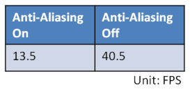
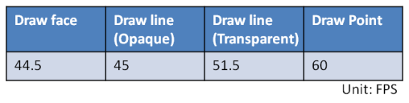

#Implement features:
* Mouse control
* Back-face culling
* Anti-aliasing
* Blending
* Correct color interpolation
* Scissor test
* Draw line and point

#Mouse control:
* Dragging mouse with the left mouse button pressed to change the view direction.
* Pressing the "Ctrl" key and dragging mouse with the left mouse button pressed to change the view port position.
* Pressing the "Alt" key and dragging mouse with the left mouse button pressed to change the light direction.
* Scroll mouse middle button to change the view scale.

#Back-face culling:
Using back-face culling could effectively reduce the required time when doing the rasterize. 
Since we could skip the process of computing the barycentric coordinate and doing the interpolation.

#Scissor test:
* Using "S" to switch On/Off the scissor test. The scissor area is a 200x200 size window in the center of the screen.
Inside the scissor test screen, the fragment shader process will be skipped. With the scissor test, the FPS should be higher than which without the scissor test. 
The save time depends on the scissor test screen size. The larger area of the scissor test is, the more time could be saved.

#Anti-Aliasing:
* Super sampling antialiasing:
In order to do the anti-aliasing, I use super sampling to pre-rasterize a 1600 * 1600 screen size image and then average the color every 4 pixels.
Because of the super sampling, the cost time on this pipe line is 4 times more than which without the anti-aliasing pipe line.

#Blending:
* Using "A" to switch On/Off the color blending effect.
* Using "Q" and "W" to Increase/Decrease the alpha value when blending.  
I create a white & black grid background to do the alpha blending with my object image. In order to do the blending, I create a kernel to deal with the color blending pixel by pixel.

#Correct color
This function is doing the color interpolation between the vertices. The required time of doing this process is almost nothing because we already have the barycentric coordinate when we doing the depth interpolation. 
What we need to do here is just using the barycentric coordinate as the weight value to multiply with the colors of each vertex.

#Draw line:
* Using "D" to switch the different display mode. 
* Draw line opaque

* Draw line transparent

* Draw Point

#Performance:
We use different block size for different process. One is for dealing with every triangle and the other is for dealing with every pixel. 
From below tables and charts we could find that when kernel is dealing with every triangle, the tile size of 8 * 8 is the most efficient setting.
On the other side, when kernel is dealing with every pixel, there is no remarkable difference of different block size. However, the tile size of 256 is slightly better than others. 

#Video:
http://youtu.be/22JkxHzivGE

