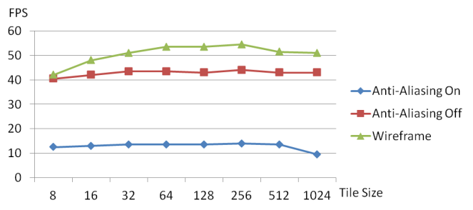

#Mouse control:
* Dragging mouse with the left mouse button pressed to change the view direction.
* Pressing the Ctrl key and dragging mouse with the left mouse button pressed to change the view port position.
* Pressing the Alt key and dragging mouse with the left mouse button pressed to change the light direction.
* Scroll mouse middle button to change the view scale.

#Back culling:

#Scissor test:
*Using "S" to switch On/Off the scissor test. The scissor area is a 200x200 size window in the center of the screen.
In the scissor test screen, the fragment shader will be skipped. With the scissor test, the FPS should be higher than which without the scissor test. 
The save time depends on the scissor test screen size. 

#Anti-Aliasing:
* Super sampling antialiasing:
In order to do the anti-aliasing, I use super sampling to pre-rasterize a 1600 *1600 screen size image and then average the color every 4 pixels.
Because of the super sampling, the cost time on this pipe line is 4 times more than which without the anti-aliasing pipe line.

#Blending:
*Using "A" to switch On/Off the color blending effect.
*Using "Q" and "W" to Increase/Decrease the alpha value when blending.  
I create a white & black grid background to do the alpha blending with my object image. 

#Correct color

#Draw line:
*Using "D" to switch the different display mode. 
*Solid

*Real line

*Point

#Performance:

http://youtu.be/22JkxHzivGE

