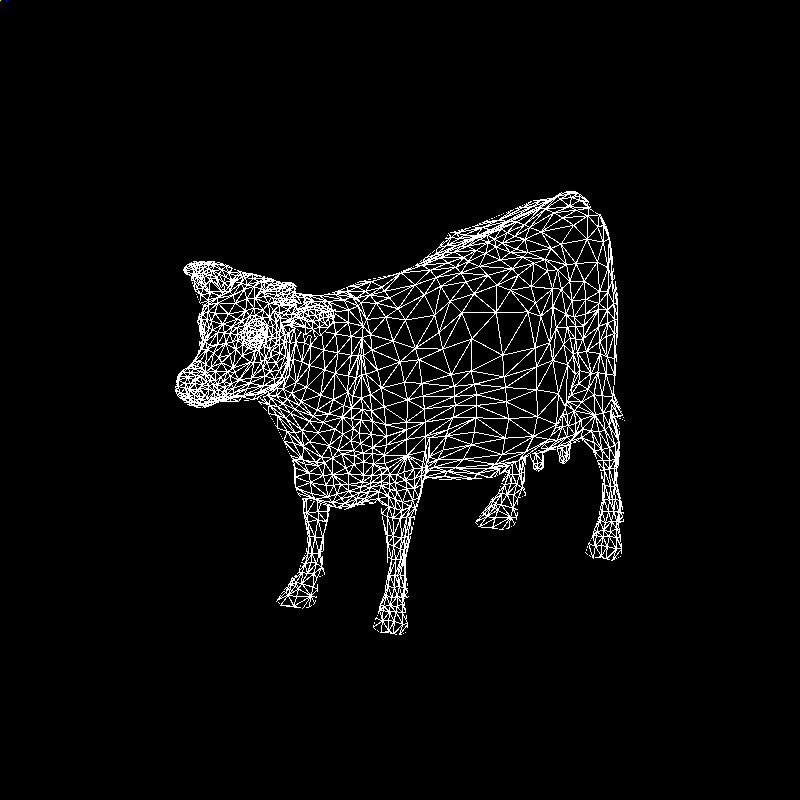

#Mouse control:
* Pressing the Alt key and dragging mouse with the left mouse button pressed to change the light direction.
* Scroll mouse middle button to change the view scale.
* Dragging mouse with the left mouse button pressed to change the view direction.
* Pressing the Ctrl key and dragging mouse with the left mouse button pressed to change the view port position.

#Back culling:

#Scissor test:
Using "S" to switch On/Off the scissor test. The scissor area is 

#Anti-Aliasing:
* Super sampling antialiasing:

#Blending:
Using "A" to switch On/Off the color blending effect.

#Draw line:
Using "D" to switch the different display mode. 
