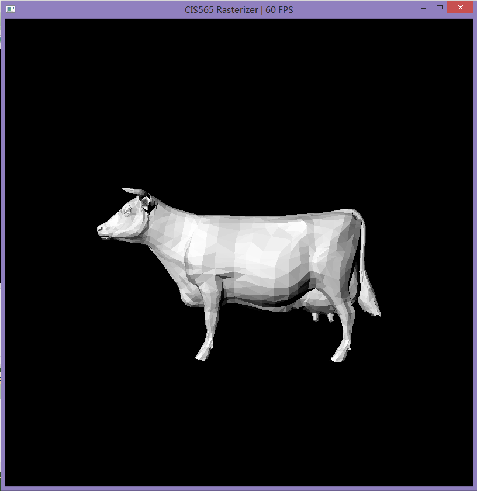

CIS565: Project 4: CUDA Rasterizer
-------------------------------------------------------------------------------

INTRODUCTION:
-------------------------------------------------------------------------------
This is a simplified CUDA based implementation of a standard rasterized graphics pipeline, similar to the OpenGL pipeline.   
The pipeline includes vertex shading, primitive assembly, perspective transformation, rasterization, fragment shading, and write the resulting fragments to a framebuffer.

BASIC FETAURES:
-------------------------------------------------------------------------------

* Vertex Shading
* Primitive Assembly with support for triangle VBOs/IBOs
* Perspective Transformation
* Rasterization through either a scanline 
* Fragment Shading
* A depth buffer for storing and depth testing fragments
* Fragment to framebuffer writing

ADVENCED FEATURES:
-------------------------------------------------------------------------------

MOUSE BASED interactive camera support  
-------------------------------------------------------------------------------
- mouse left click + drag: rotate the camera around the lookat center  
- mouse right click + drag: translate the camera lookat point  
- mouse scroll: zoom in/out   
The video below shows how the interaction is like.   
[] (http://youtu.be/34XS6eS-lT8)    

Keyboard Control
-------------------------------------------------------------------------------
- p: performance analysis on/off
- 1: points raster on/off
- 2: line raster on/off
- 3: normal based shading
- 4: face orientation shading
- 5: diffuse shading
- 6: blinn shading
- 7: texture map 

Back-face culling  
-------------------------------------------------------------------------------
This is done by checking the normal of current triangle face, if the normal is pointing backwards, then discard shading this face.

Different Shading mode 
-------------------------------------------------------------------------------
* Points

* Lines

* normal based shading

* face orientation shading (Correct color interpolation between points on a primitive)

* diffuse shading

* blinn shading

* texture map (WITH texture filtering and perspective correct texture coordinates)
Reading a texture image is completed with the support of "FreeImage". TODO, the perspectively correct texture map is not finished yet.

PERFORMANCE EVALUATION
-------------------------------------------------------------------------------
I noticed that when the camera zooms in, the rasterizer fps drops significantly. So I started the comparison between camera zoom-out and camera zoom-in, with other set up exactly same.  
The pictures below describes the camera zoom distance, and the corresponding performance analysis.  
* Time Consumption Pie Chart for Pipeline (zoom-out, cow model)

* Time Consumption Pie Chart for Pipeline (zoom-in, cow model)

It can be noticed that the rasterization takes additional time when camera zooms in, and introduces drop of efficiency. And all the rest stage takes roughly the same amount of time no matter zooms in or zooms out.  
This is probably because when the camera is closer, each of the triangle face will become bigger, which occupies more pixels, hence takes longer to complete rasterization. 
One possible solution is to parallelize the naive scanline approach, so save the consumption in iteration through many fragments.  

REFERRENCES
-------------------------------------------------------------------------------
loading texture image  
 - http://www.mingw.org/
 - http://freeimage.sourceforge.net/download.html
 - https://www.opengl.org/discussion_boards/showthread.php/163929-image-loading?p=1158293#post1158293
 - http://inst.eecs.berkeley.edu/~cs184/fa09/resources/sec_UsingFreeImage.pdf

perspectively correct texture mapping   
 - http://www.lysator.liu.se/~mikaelk/doc/perspectivetexture/
-  http://chrishecker.com/Miscellaneous_Technical_Articles
